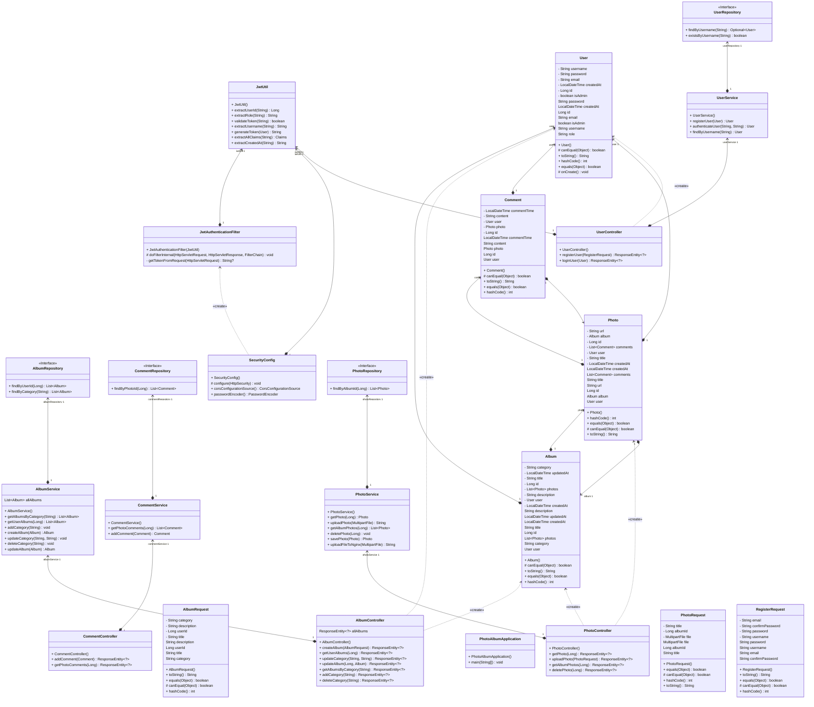

```mermaid
classDiagram
direction BT
class Album {
  + Album() 
  - String category
  - LocalDateTime updatedAt
  - String title
  - Long id
  - List~Photo~ photos
  - String description
  - User user
  - LocalDateTime createdAt
  # canEqual(Object) boolean
  + toString() String
  + equals(Object) boolean
  + hashCode() int
   String description
   LocalDateTime updatedAt
   LocalDateTime createdAt
   String title
   Long id
   List~Photo~ photos
   String category
   User user
}
class AlbumController {
  + AlbumController() 
  + createAlbum(AlbumRequest) ResponseEntity~?~
  + getUserAlbums(Long) ResponseEntity~?~
  + updateCategory(String, String) ResponseEntity~?~
  + updateAlbum(Long, Album) ResponseEntity~?~
  + getAlbumsByCategory(String) ResponseEntity~?~
  + addCategory(String) ResponseEntity~?~
  + deleteCategory(String) ResponseEntity~?~
   ResponseEntity~?~ allAlbums
}
class AlbumRepository {
<<Interface>>
  + findByUserId(Long) List~Album~
  + findByCategory(String) List~Album~
}
class AlbumRequest {
  + AlbumRequest() 
  - String category
  - String description
  - Long userId
  - String title
  + toString() String
  + equals(Object) boolean
  # canEqual(Object) boolean
  + hashCode() int
   String description
   Long userId
   String title
   String category
}
class AlbumService {
  + AlbumService() 
  + getAlbumsByCategory(String) List~Album~
  + getUserAlbums(Long) List~Album~
  + addCategory(String) void
  + createAlbum(Album) Album
  + updateCategory(String, String) void
  + deleteCategory(String) void
  + updateAlbum(Album) Album
   List~Album~ allAlbums
}
class Comment {
  + Comment() 
  - LocalDateTime commentTime
  - String content
  - User user
  - Photo photo
  - Long id
  # canEqual(Object) boolean
  + toString() String
  + equals(Object) boolean
  + hashCode() int
   LocalDateTime commentTime
   String content
   Photo photo
   Long id
   User user
}
class CommentController {
  + CommentController() 
  + addComment(Comment) ResponseEntity~?~
  + getPhotoComments(Long) ResponseEntity~?~
}
class CommentRepository {
<<Interface>>
  + findByPhotoId(Long) List~Comment~
}
class CommentService {
  + CommentService() 
  + getPhotoComments(Long) List~Comment~
  + addComment(Comment) Comment
}
class JwtAuthenticationFilter {
  + JwtAuthenticationFilter(JwtUtil) 
  # doFilterInternal(HttpServletRequest, HttpServletResponse, FilterChain) void
  - getTokenFromRequest(HttpServletRequest) String?
}
class JwtUtil {
  + JwtUtil() 
  + extractUserId(String) Long
  + extractRole(String) String
  + validateToken(String) boolean
  + extractUsername(String) String
  + generateToken(User) String
  + extractAllClaims(String) Claims
  + extractCreatedAt(String) String
}
class Photo {
  + Photo() 
  - String url
  - Album album
  - Long id
  - List~Comment~ comments
  - User user
  - String title
  - LocalDateTime createdAt
  + hashCode() int
  + equals(Object) boolean
  # canEqual(Object) boolean
  + toString() String
   LocalDateTime createdAt
   List~Comment~ comments
   String title
   String url
   Long id
   Album album
   User user
}
class PhotoAlbumApplication {
  + PhotoAlbumApplication() 
  + main(String[]) void
}
class PhotoController {
  + PhotoController() 
  + getPhoto(Long) ResponseEntity~?~
  + uploadPhoto(PhotoRequest) ResponseEntity~?~
  + getAlbumPhotos(Long) ResponseEntity~?~
  + deletePhoto(Long) ResponseEntity~?~
}
class PhotoRepository {
<<Interface>>
  + findByAlbumId(Long) List~Photo~
}
class PhotoRequest {
  + PhotoRequest() 
  - String title
  - Long albumId
  - MultipartFile file
  + equals(Object) boolean
  # canEqual(Object) boolean
  + hashCode() int
  + toString() String
   MultipartFile file
   Long albumId
   String title
}
class PhotoService {
  + PhotoService() 
  + getPhoto(Long) Photo
  + uploadPhoto(MultipartFile) String
  + getAlbumPhotos(Long) List~Photo~
  + deletePhoto(Long) void
  + savePhoto(Photo) Photo
  + uploadFileToNginx(MultipartFile) String
}
class RegisterRequest {
  + RegisterRequest() 
  - String email
  - String confirmPassword
  - String password
  - String username
  + toString() String
  + equals(Object) boolean
  # canEqual(Object) boolean
  + hashCode() int
   String password
   String username
   String email
   String confirmPassword
}
class SecurityConfig {
  + SecurityConfig() 
  # configure(HttpSecurity) void
  + corsConfigurationSource() CorsConfigurationSource
  + passwordEncoder() PasswordEncoder
}
class User {
  + User() 
  - String username
  - String password
  - String email
  - LocalDateTime createdAt
  - Long id
  - boolean isAdmin
  # canEqual(Object) boolean
  + toString() String
  + hashCode() int
  + equals(Object) boolean
  # onCreate() void
   String password
   LocalDateTime createdAt
   Long id
   String email
   boolean isAdmin
   String username
   String role
}
class UserController {
  + UserController() 
  + registerUser(RegisterRequest) ResponseEntity~?~
  + loginUser(User) ResponseEntity~?~
}
class UserRepository {
<<Interface>>
  + findByUsername(String) Optional~User~
  + existsByUsername(String) boolean
}
class UserService {
  + UserService() 
  + registerUser(User) User
  + authenticateUser(String, String) User
  + findByUsername(String) User
}

Album "1" *--> "photos *" Photo 
Album "1" *--> "user 1" User 
AlbumController  ..>  Album : «create»
AlbumController "1" *--> "albumService 1" AlbumService 
AlbumController  ..>  User : «create»
AlbumService "1" *--> "albumRepository 1" AlbumRepository 
Comment "1" *--> "photo 1" Photo 
Comment "1" *--> "user 1" User 
CommentController "1" *--> "commentService 1" CommentService 
CommentService "1" *--> "commentRepository 1" CommentRepository 
JwtAuthenticationFilter "1" *--> "jwtUtil 1" JwtUtil 
Photo "1" *--> "album 1" Album 
Photo "1" *--> "comments *" Comment 
Photo "1" *--> "user 1" User 
PhotoController  ..>  Album : «create»
PhotoController  ..>  Photo : «create»
PhotoController "1" *--> "photoService 1" PhotoService 
PhotoService "1" *--> "photoRepository 1" PhotoRepository 
SecurityConfig  ..>  JwtAuthenticationFilter : «create»
SecurityConfig "1" *--> "jwtUtil 1" JwtUtil 
UserController "1" *--> "jwtUtil 1" JwtUtil 
UserController  ..>  User : «create»
UserController "1" *--> "userService 1" UserService 
UserService "1" *--> "userRepository 1" UserRepository 
```
