# Memento - 一个简单的电子相册管理系统

## 系统设计目标

面向对象的电子相册系统旨在为用户提供一个集成照片管理、编辑和互动的数字化平台。用户能够通过系统上传、分类、浏览照片，并进行评论和互动。该系统将提供跨设备的无缝访问，并具有高效、用户友好的界面。

## 系统结构

## 功能设计

### 用户管理

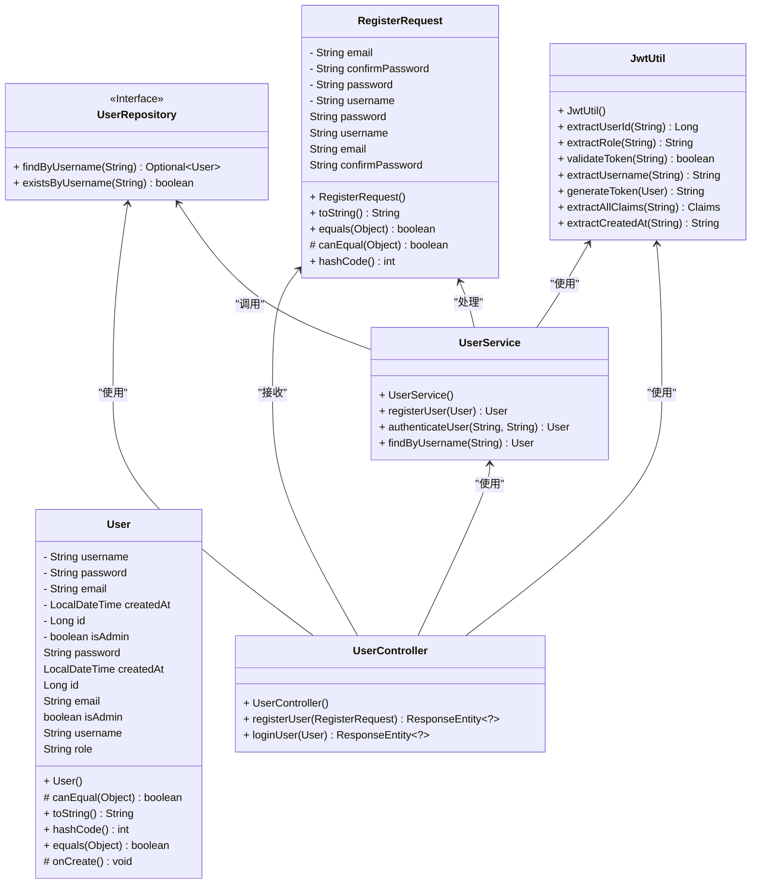

#### 用户注册&登录

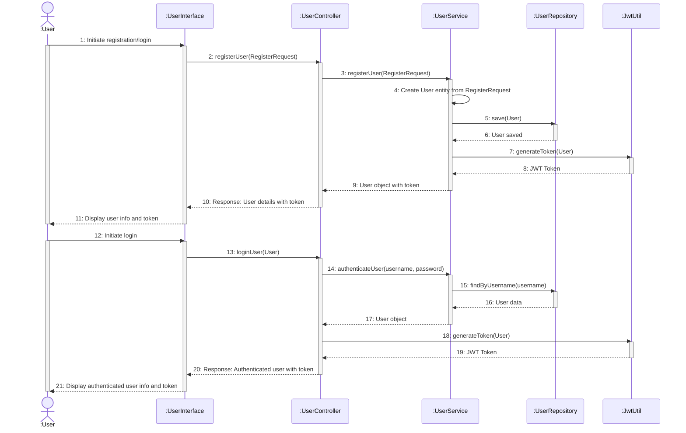
用户注册和登录的流程如上所示，用户首先通过用户界面发起注册或登录请求，然后由用户控制器将请求转发给用户服务。用户服务将处理注册或登录请求，并将用户信息保存到数据库中。注册成功后，用户服务将生成一个JWT令牌，并返回给用户控制器。用户控制器将JWT令牌返回给用户界面，用户界面将显示用户信息和令牌。登录过程类似，但是用户服务将验证用户的用户名和密码，然后生成JWT令牌。

### 相册管理

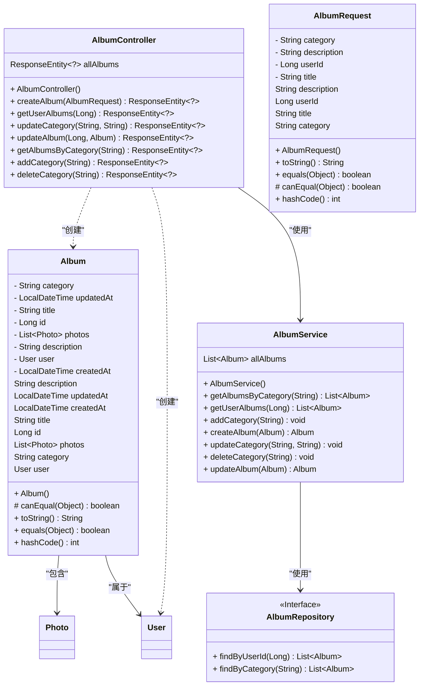

#### 创建相册

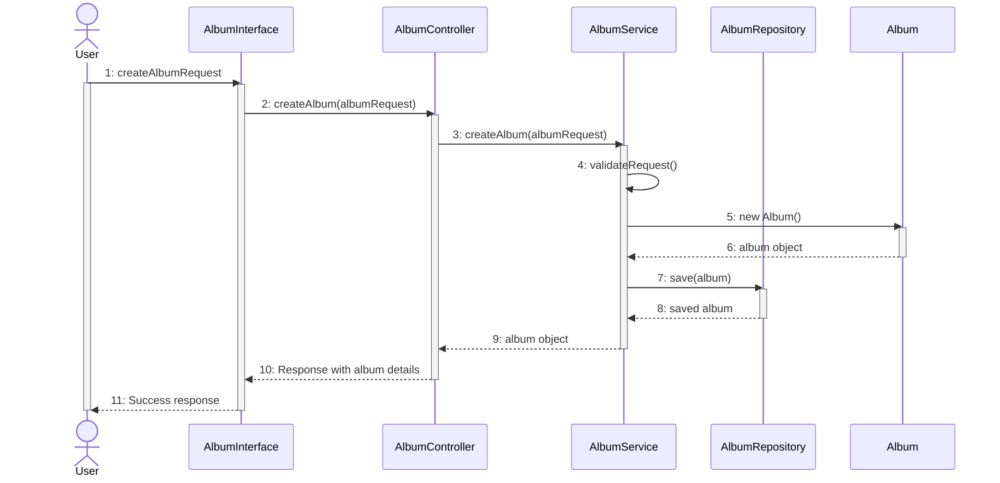
创建相册的流程如上所示，用户首先通过用户界面发起创建相册请求，然后由相册控制器将请求转发给相册服务。相册服务将处理创建相册请求，并将相册信息保存到数据库中。创建成功后，相册服务将返回相册对象给相册控制器。相册控制器将返回相册对象给用户界面，用户界面将显示相册信息。

#### 修改相册

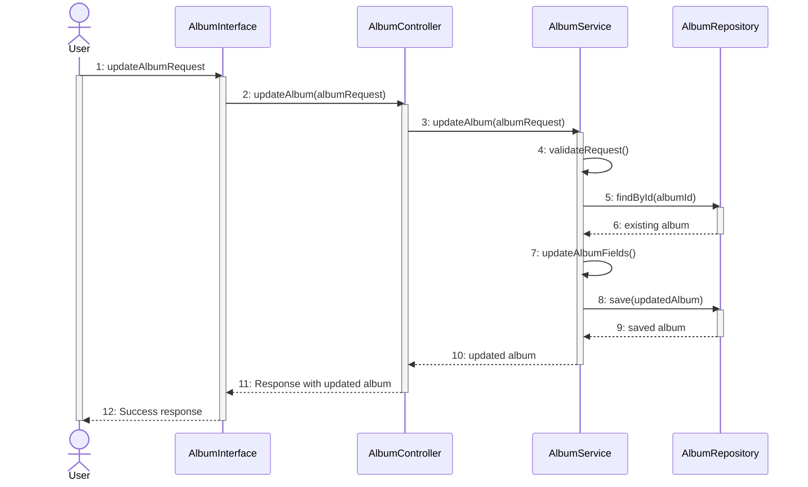
修改相册的流程如上所示，用户首先通过用户界面发起修改相册请求，然后由相册控制器将请求转发给相册服务。相册服务将处理修改相册请求，并将相册信息保存到数据库中。修改成功后，相册服务将返回相册对象给相册控制器。相册控制器将返回相册对象给用户界面，用户界面将显示相册信息。

#### 相册类别管理

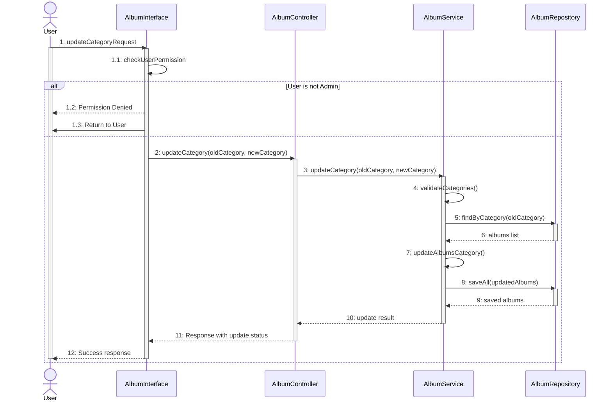
相册类别管理的流程如上所示，用户首先通过用户界面发起修改相册类别请求，然后由相册控制器将请求转发给相册服务。相册服务将处理修改相册类别请求，并将新的相册类别信息保存到数据库中。修改成功后，相册服务将找到所有原类别的相册，并将其类别更新为新类别。最后，相册服务将返回更新结果给相册控制器。相册控制器将返回更新结果给用户界面，用户界面将显示更新结果。

### 图片管理

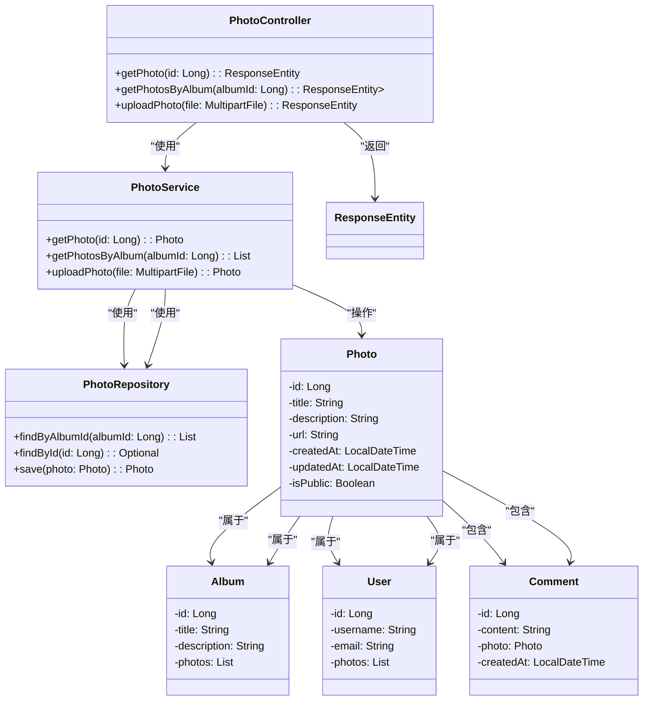

#### 上传图片

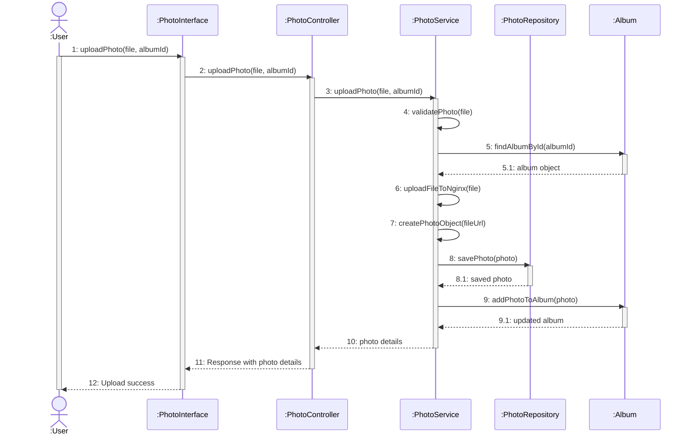
上传图片的流程如上所示，用户首先通过用户界面发起上传图片请求，然后由图片控制器将请求转发给图片服务。图片服务将处理上传图片请求，并首先验证图片文件。然后，图片服务将查找相册信息，上传图片文件到Nginx服务器，并创建图片对象。接着，图片服务将保存图片对象到数据库中，并将图片添加到相册中。最后，图片服务将返回图片信息给图片控制器。图片控制器将返回响应给用户界面，用户界面将显示上传图片信息。

#### 浏览图片

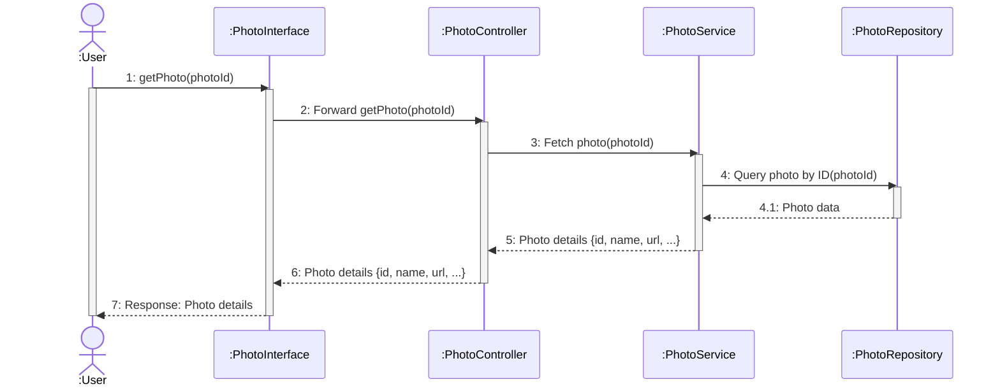
浏览图片的流程如上所示，用户首先通过用户界面发起浏览图片请求，然后由图片控制器将请求转发给图片服务。图片服务将处理浏览图片请求，并查找数据库中的图片信息。最后，图片服务将返回图片信息给图片控制器。图片控制器将返回响应给用户界面，用户界面将显示图片信息。

### 评论管理

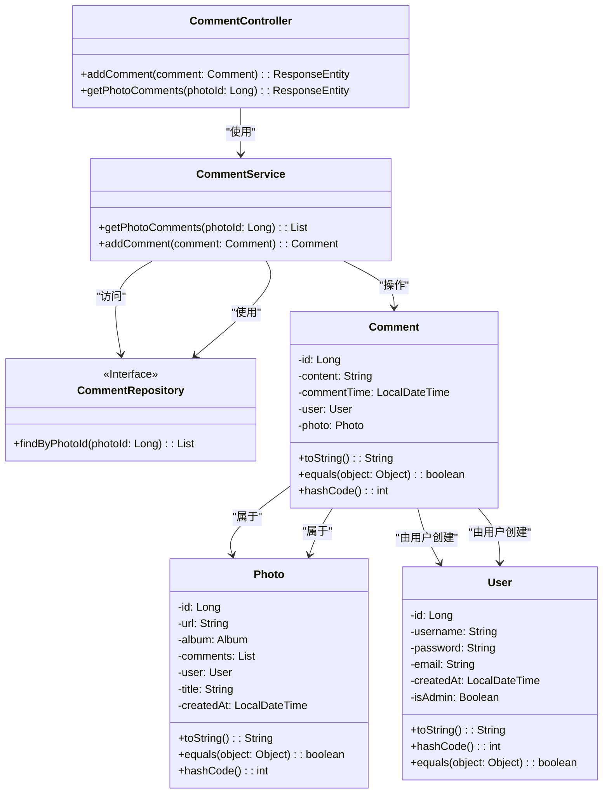

#### 发表评论

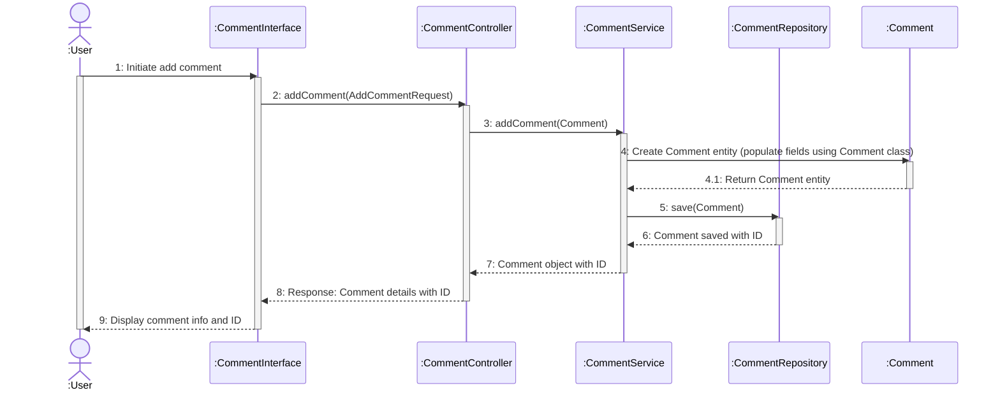
发表评论的流程如上所示，用户首先通过用户界面发起发表评论请求，然后由评论控制器将请求转发给评论服务。评论服务将处理发表评论请求，并将评论信息保存到数据库中。发表成功后，评论服务将返回评论对象给评论控制器。评论控制器将返回评论对象给用户界面，用户界面将显示评论信息。

#### 获取图片评论

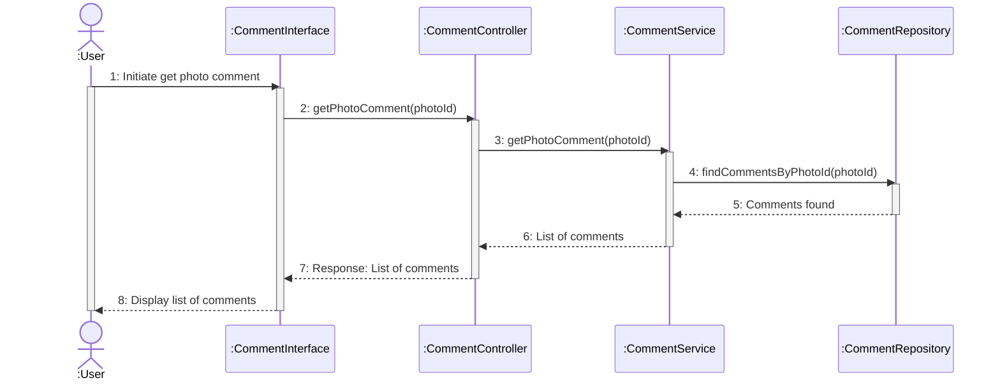
获取图片评论的流程如上所示，用户首先通过用户界面发起获取图片评论请求，然后由评论控制器将请求转发给评论服务。评论服务将处理获取图片评论请求，并根据图片的id查找数据库中的评论信息。最后，评论服务将返回评论信息给评论控制器。评论控制器将返回评论信息给用户界面，用户界面将显示评论信息。

## 界面设计

### 页面设计

#### 1. **登录页 (Login)**:

*   **功能**: 允许用户通过用户名和密码登录。
*   **界面元素**:
    *   标题：`Login`
    *   输入框：`Username`、`Password`
    *   登录按钮
    *   链接到`注册`页面
    *   错误提示（如果登录失败）

#### 2. **注册页 (Register)**:

*   **功能**: 允许新用户注册账号。
*   **界面元素**:
    *   标题：`Register`
    *   输入框：`Username`、`Password`、`Confirm Password`、`Email`
    *   注册按钮
    *   链接到`登录`页面

#### 3. **相册列表页 (AlbumList)**:

*   **功能**: 显示所有相册的预览和基本信息，用户可以浏览相册。
*   **界面元素**:
    *   页面标题：`Albums`
    *   相册卡片：每个相册包括封面图、标题、描述、创建日期等信息
    *   每个相册的点击链接可以进入相册的详情页
    *   `添加相册`按钮（如果用户有权限）

#### 4. **相册详情页 (PhotoGridView)**:

*   **功能**: 显示相册中所有的照片，采用网格视图。
*   **界面元素**:
    *   页面标题：相册名称
    *   照片网格：展示每张照片的缩略图
    *   点击缩略图查看大图（跳转至`PhotoView`页面）
    *   `返回相册`按钮

#### 5. **照片查看页 (PhotoView)**:

*   **功能**: 展示单张照片的详细信息，允许用户查看大图。
*   **界面元素**:
    *   页面标题：照片标题
    *   照片大图
    *   照片描述
    *   `返回相册`按钮

#### 6. **管理员仪表盘页 (AdminDashboard)**:

*   **功能**: 允许管理员管理用户和相册。
*   **界面元素**:
    *   页面标题：`Admin Dashboard`
    *   用户管理功能：列出所有用户，查看/删除用户
    *   相册管理功能：查看所有相册，删除相册，修改相册信息
    *   统计信息：例如：用户数、相册数、照片数等

#### 7. **布局组件 (Layout)**:

*   **功能**: 作为所有页面的框架，包含头部、侧边栏、导航等。
*   **界面元素**:
    *   **导航栏**: 包括链接到`Login`、`Register`、`Albums`、`Admin Dashboard`（如果用户是管理员）
    *   **侧边栏（可选）**: 在用户登录后，提供额外的功能链接（如`User Profile`、`Settings`）
    *   **页脚**: 显示版权信息、联系信息等

### 总体界面设计概述：

*   **页面布局**:
    
    *   **顶部导航栏**: 显示全局导航，如首页、登录、注册、相册、管理员页面等。
    *   **侧边栏（可选）**: 在用户登录后，展示更多的操作项，如`我的相册`、`用户资料`等。
    *   **内容区域**: 主体部分会根据路由不同展示不同的页面内容。
*   **色调与风格**:
    
    *   **现代简洁**: 使用干净的布局，尽量减少不必要的装饰，使用户能专注于内容。
    *   **响应式设计**: 确保界面在不同设备上（桌面、平板、手机）都能友好显示。
    *   **卡片设计**: 特别是相册和照片的展示，采用卡片式布局，使内容更加直观和可操作。

### 关键页面交互流程：

1.  **未登录时**:
    *   用户首先会看到`Login`或`Register`页面，通过表单登录或注册。
    *   登录后进入`AlbumList`页面，浏览自己的相册。
2.  **已登录时**:
    *   用户可以点击相册进入`PhotoGridView`查看相册中的照片。
    *   用户点击照片查看大图，跳转至`PhotoView`页面。
3.  **管理员视图**:
    *   如果是管理员，用户可以访问`AdminDashboard`来管理用户、相册和查看系统统计数据。

### 界面设计的技术考虑：

*   使用 **React Router** 来管理页面的导航和路由。
*   使用 **状态管理**（如 `Context API` 或 `Redux`）来管理用户登录状态和身份验证。
*   页面布局可以使用 **CSS Flexbox** 或 **CSS Grid** 进行响应式设计。

## 非功能设计

## 数据库设计

### E-R图

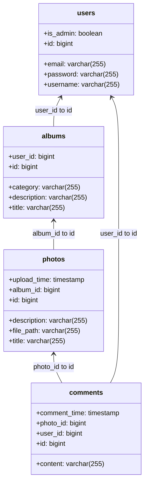

### 表设计

#### 用户表

| 表字段 | 类型 | 中文名 | 备注 | 默认值 | 是否非空 |
| --- | --- | --- | --- | --- | --- |
| id | bigserial | 用户ID | 主键 | nextval('users_id_seq'::regclass) | 是 |
| created_at | timestamp | 创建时间 | | | 是 |
| email | varchar(255) | 邮箱 | | | 否 |
| is_admin | bool | 是否管理员 | | false | 是 |
| password | varchar(255) | 密码 | | | 否 |
| username | varchar(255) | 用户名 | | | 否 |

#### 相册表

| 表字段 | 类型 | 中文名 | 备注 | 默认值 | 是否非空 |
| --- | --- | --- | --- | --- | --- |
| id | bigserial | 相册ID | 主键 | nextval('albums_id_seq'::regclass) | 是 |
| category | varchar(255) | 相册类别 | | | 否 |
| created_at | timestamp | 创建时间 | | | 否 |
| description | varchar(255) | 相册描述 | | | 否 |
| title | varchar(255) | 相册标题 | | | 否 |
| updated_at | timestamp | 更新时间 | | | 否 |
| user_id | int8 | 用户ID | 外键 | | 否 |

#### 图片表

| 表字段 | 类型 | 中文名 | 备注 | 默认值 | 是否非空 |
| --- | --- | --- | --- | --- | --- |
| id | bigserial | 图片ID | 主键 | nextval('photos_id_seq'::regclass) | 是 |
| created_at | timestamp | 创建时间 | | | 否 |
| title | varchar(255) | 图片标题 | | | 否 |
| url | varchar(255) | 图片URL | | | 否 |
| album_id | int8 | 相册ID | 外键 | | 否 |
| user_id | int8 | 用户ID | 外键 | | 否 |

#### 评论表

| 表字段 | 类型 | 中文名 | 备注 | 默认值 | 是否非空 |
| --- | --- | --- | --- | --- | --- |
| id | bigserial | 评论ID | 主键 | nextval('comments_id_seq'::regclass) | 是 |
| comment_time | timestamp | 评论时间 | | | 否 |
| content | varchar(255) | 评论内容 | | | 否 |
| photo_id | int8 | 图片ID | 外键 | | 否 |
| user_id | int8 | 用户ID | 外键 | | 否 |
