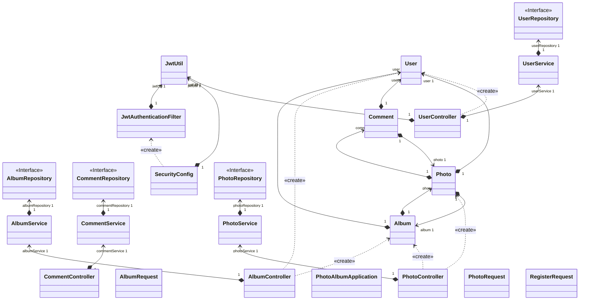

# Memento - 一个简单的电子相册管理系统

## 系统设计目标

面向对象的电子相册系统旨在为用户提供一个集成照片管理、编辑和互动的数字化平台。用户能够通过系统上传、分类、浏览照片，并进行评论和互动。该系统将提供跨设备的无缝访问，并具有高效、用户友好的界面。

## 系统结构

## 功能设计

### 用户管理

#### 用户注册

#### 用户登录

### 相册管理

#### 创建相册

#### 修改相册

#### 相册类别管理

### 图片管理

#### 上传图片

#### 浏览图片

### 评论管理

#### 发表评论
