# Memento - 一个简单的电子相册管理系统

## 系统设计目标

面向对象的电子相册系统旨在为用户提供一个集成照片管理、编辑和互动的数字化平台。用户能够通过系统上传、分类、浏览照片，并进行评论和互动。该系统将提供跨设备的无缝访问，并具有高效、用户友好的界面。

## 系统结构


## 功能设计

### 用户管理

#### 用户注册
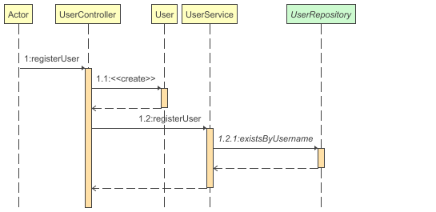
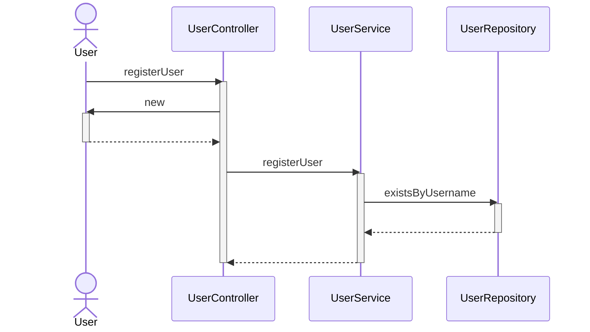

#### 用户登录
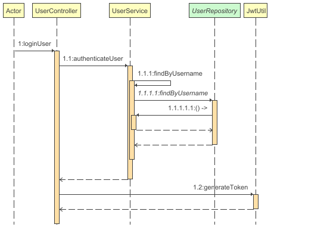
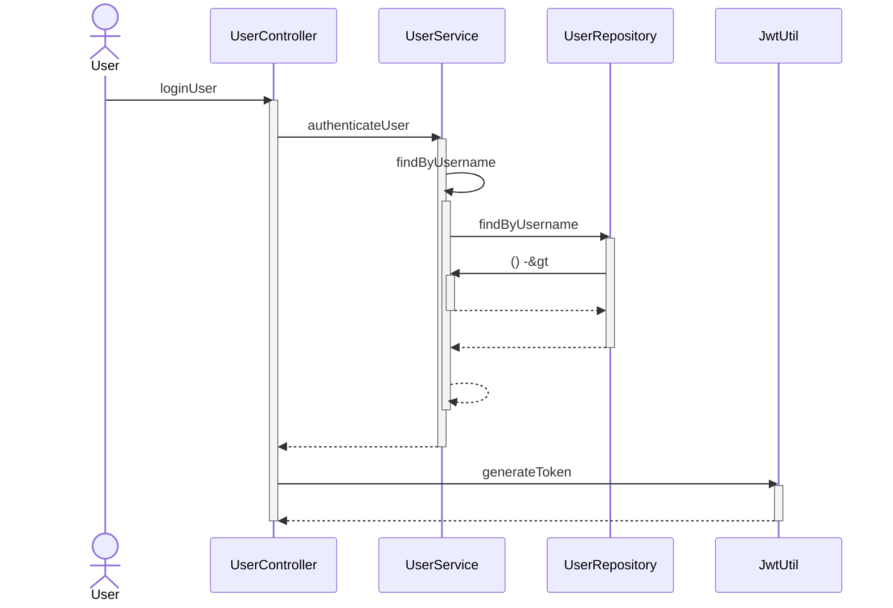

### 相册管理

#### 创建相册
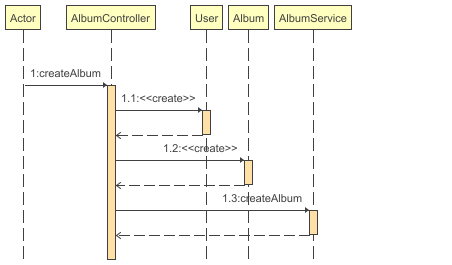
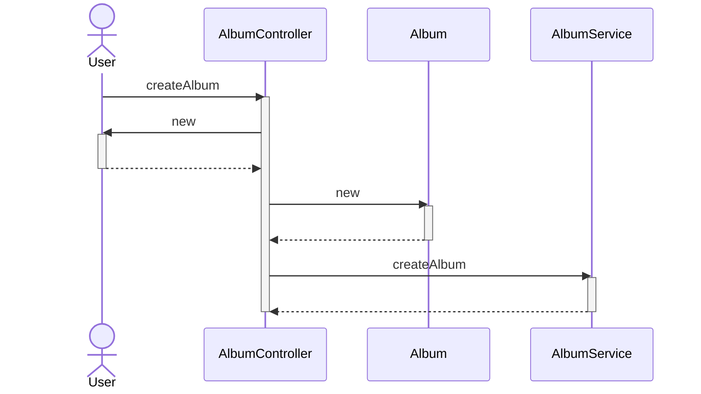

#### 修改相册
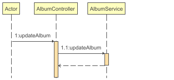
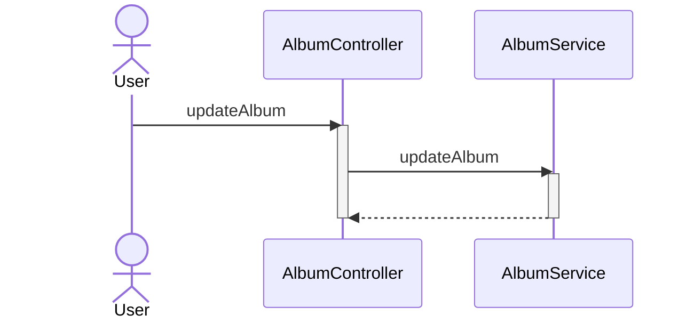

#### 相册类别管理
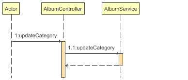
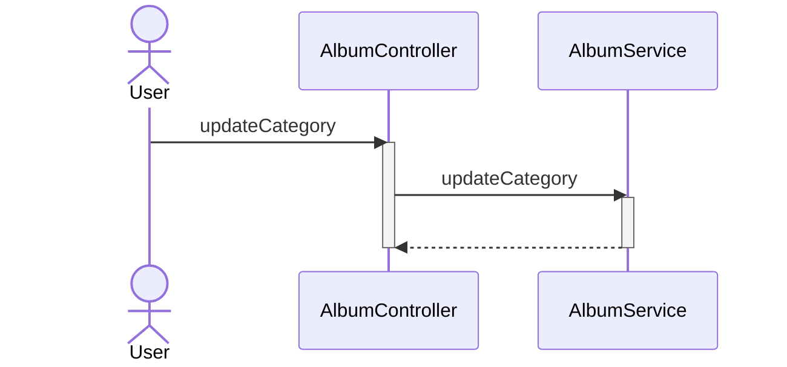

### 图片管理

#### 上传图片
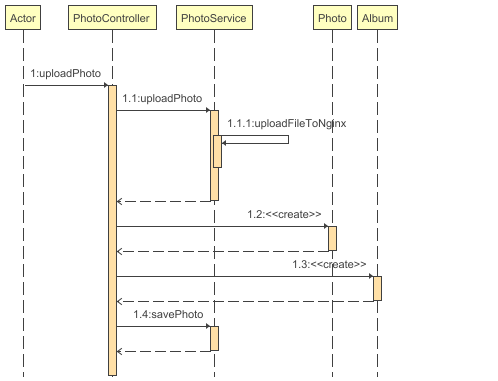
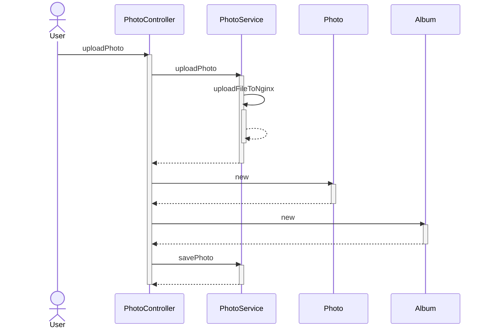

#### 浏览图片
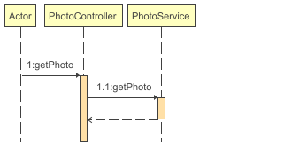
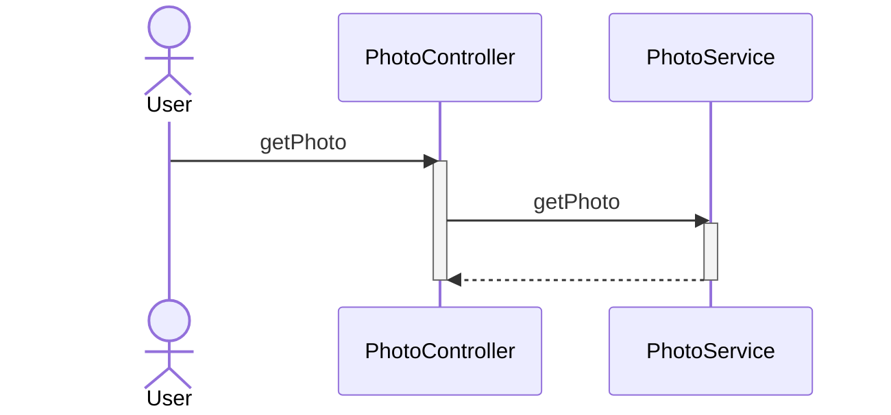

### 评论管理

#### 发表评论
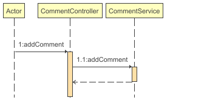
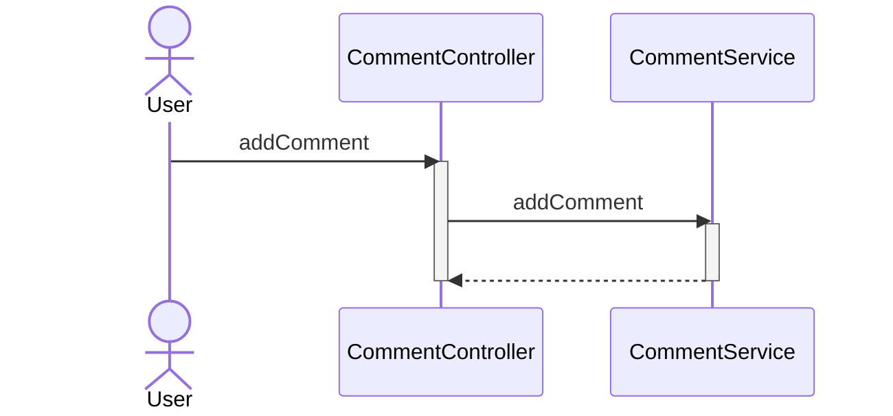

## 界面设计

## 非功能设计

## 数据库设计

### E-R图
```mermaid
classDiagram
direction BT
class albums {
   varchar(255) category
   varchar(255) description
   varchar(255) title
   bigint user_id
   bigint id
}
class comments {
   timestamp comment_time
   varchar(255) content
   bigint photo_id
   bigint user_id
   bigint id
}
class photos {
   varchar(255) description
   varchar(255) file_path
   varchar(255) title
   timestamp upload_time
   bigint album_id
   bigint id
}
class users {
   varchar(255) email
   boolean is_admin
   varchar(255) password
   varchar(255) username
   bigint id
}

albums  -->  users : user_id:id
comments  -->  photos : photo_id:id
comments  -->  users : user_id:id
photos  -->  albums : album_id:id
```

### 表设计


