# Memento - 一个简单的电子相册管理系统

## 系统设计目标

面向对象的电子相册系统旨在为用户提供一个集成照片管理、编辑和互动的数字化平台。用户能够通过系统上传、分类、浏览照片，并进行评论和互动。该系统将提供跨设备的无缝访问，并具有高效、用户友好的界面。

## 系统结构

## 功能设计

### 用户管理

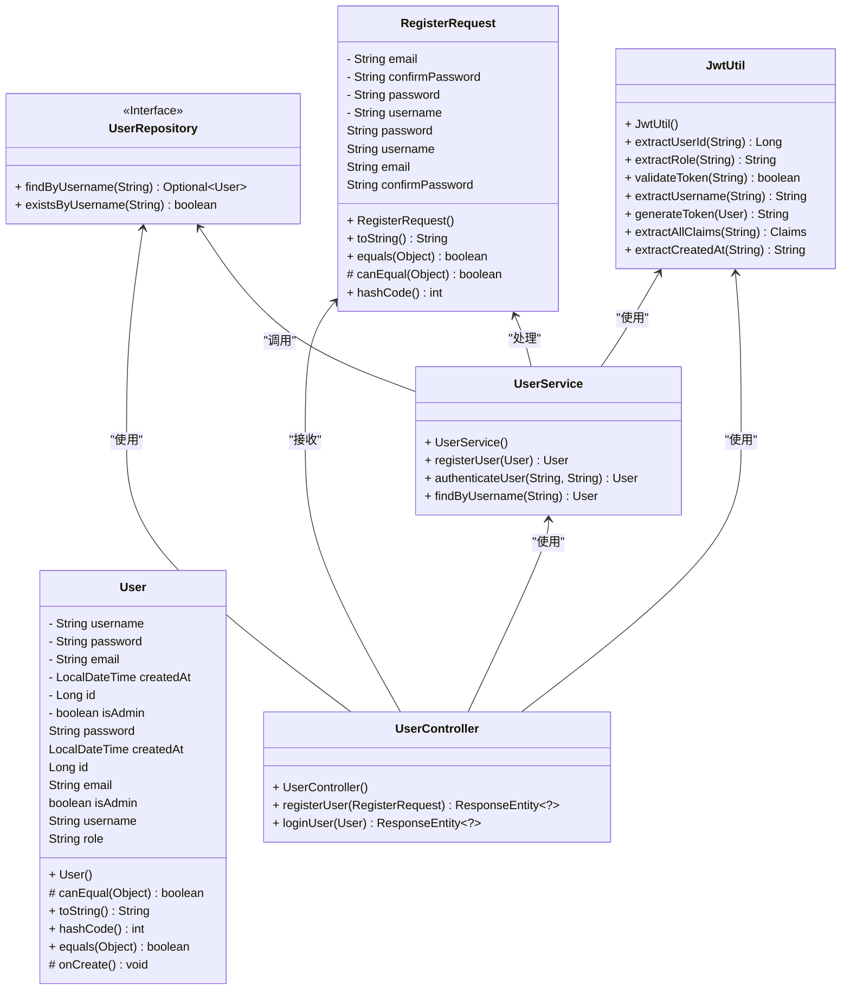

#### 用户注册&登录

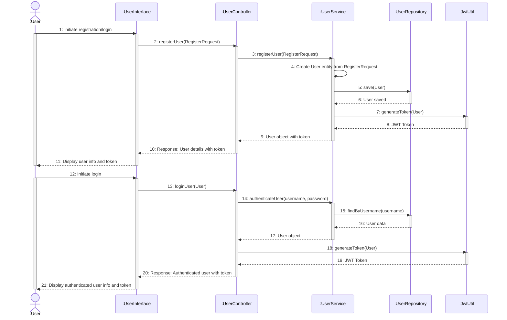

### 相册管理

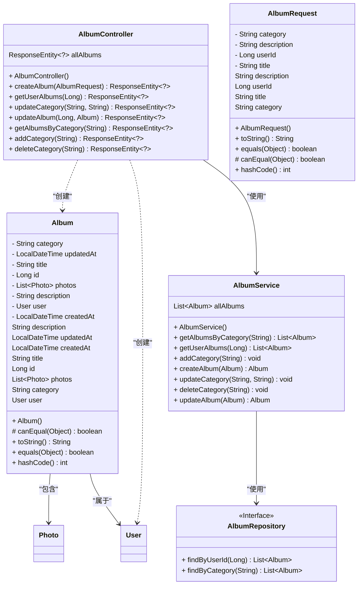

#### 创建相册

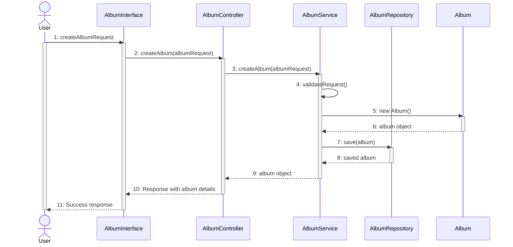

#### 修改相册

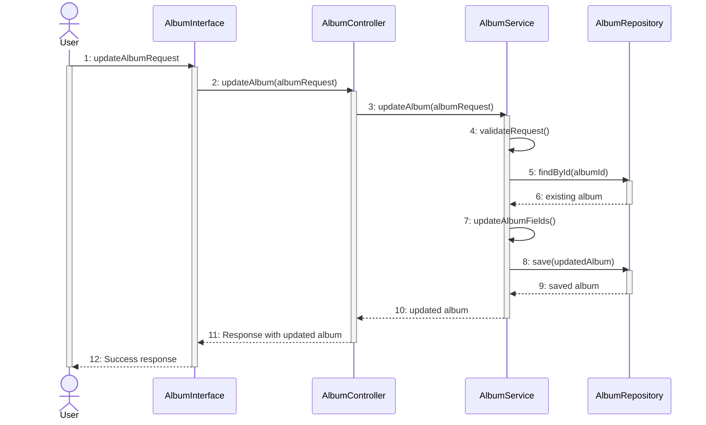

#### 相册类别管理

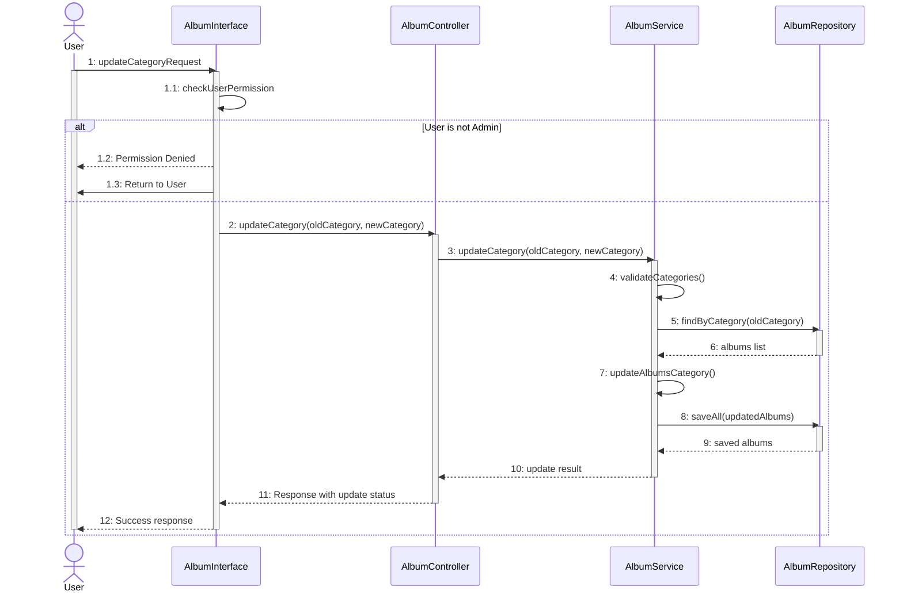

### 图片管理

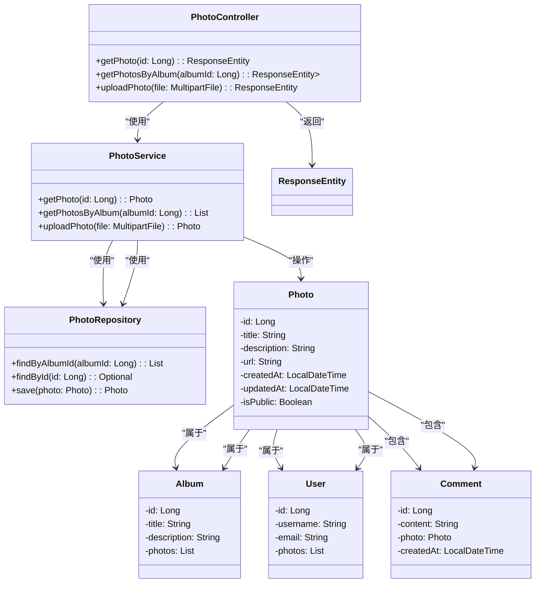

#### 上传图片

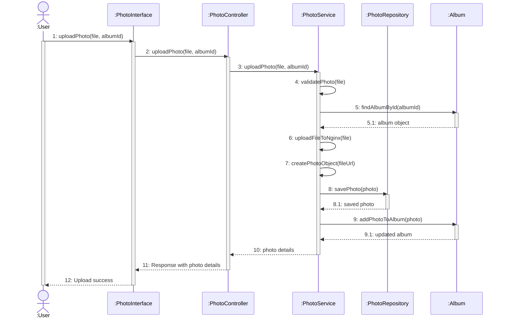

#### 浏览图片

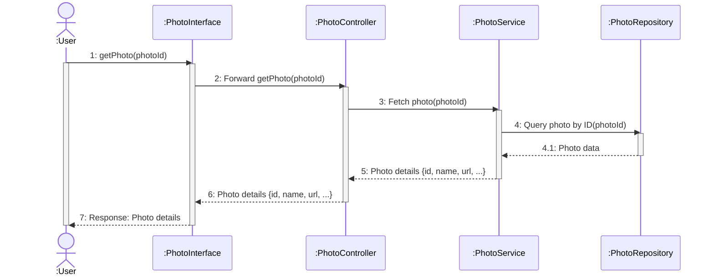

### 评论管理

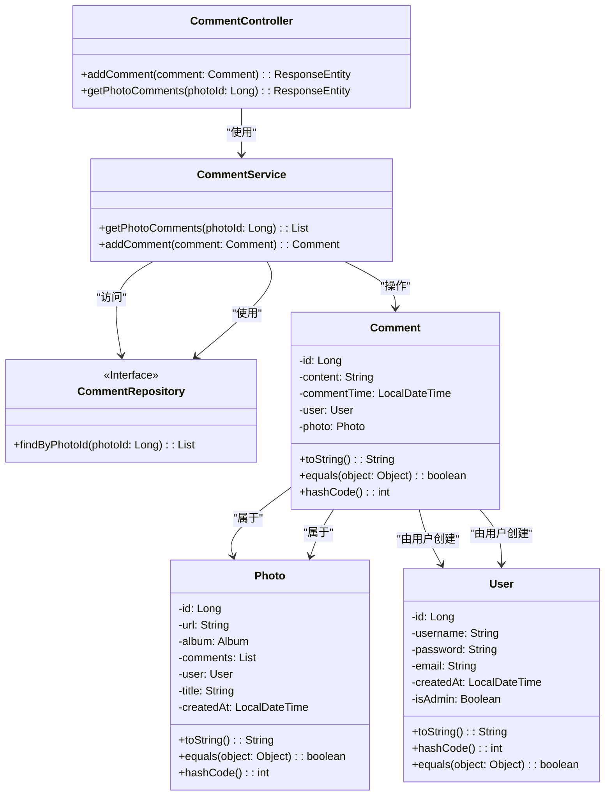

#### 发表评论

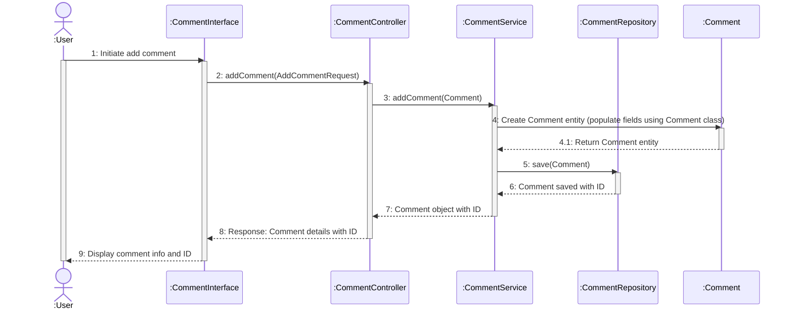

#### 获取图片评论

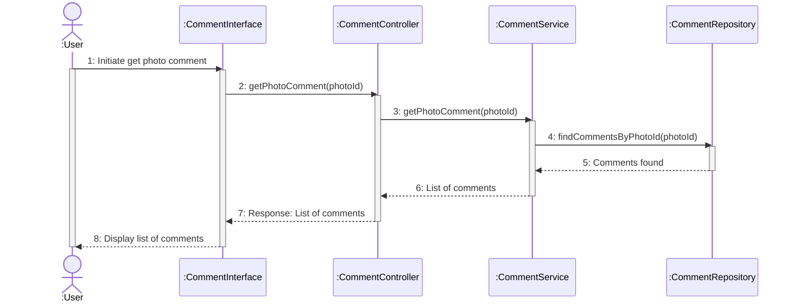

## 界面设计

## 非功能设计

## 数据库设计

### E-R图

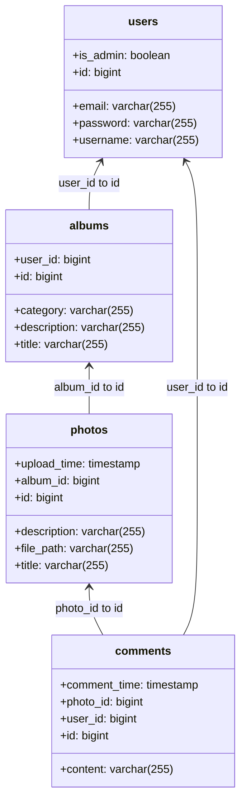

### 表设计

#### 用户表

| 表字段 | 类型 | 中文名 | 备注 | 默认值 | 是否非空 |
| --- | --- | --- | --- | --- | --- |
| id | bigserial | 用户ID | 主键 | nextval('users_id_seq'::regclass) | 是 |
| created_at | timestamp | 创建时间 | | | 是 |
| email | varchar(255) | 邮箱 | | | 否 |
| is_admin | bool | 是否管理员 | | false | 是 |
| password | varchar(255) | 密码 | | | 是 |
| username | varchar(255) | 用户名 | | | 是 |
